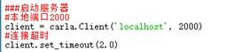
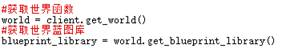
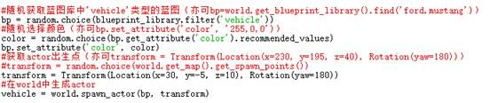
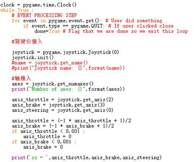
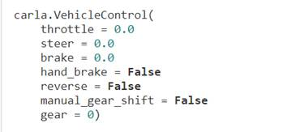

### Carla 安装与基本API教程

Carla分为两种版本，一种是Release版（已经将unreal4引擎、carla脚本打包成编译包的版本，可以直接下载运行.exe文件使用），一种是自行安装工具和依赖项的编译版（需要自行下载虚幻引擎和carla源代码并构建生成脚本）。两者区别不大，如果对场景环境模型有需求的话需要自行安装版，然后在虚幻引擎中修改场景。

目前所使用的Carla版本为0.9.4，只有Release版。

Release版获取地址：

https://github.com/carla-simulator/carla/releases

自行安装版教程：

https://carla.readthedocs.io/en/latest/

#### 一、Release版安装教程（windows平台）

1、下载编译包并解压缩。

2、下载Anaconda（python 3.7以上版本）,安装pygame库，推荐使用pygame-1.9.4-cp37-cp37m-win_amd64.whl文件安装。

3、运行CarlaUE4.exe，即可打开主窗口，如果出现未能找到Carla模块的错误，则导入库时添加以下语句（文件位置自行修改）：

- sys.path.append('D:\Carla\CARLA_0.9.4\PythonAPI\carla-0.9.4-py3.7-win-amd64.egg');

- sys.path.append('D:\Carla\CARLA_0.9.4');

#### 二、API基础

（均可参考https://carla.readthedocs.io/en/latest/）

1、导入必须的包、库，这个可以从其他示例文档中复制粘贴（能跑通一个例子就可以）。

2、建立脚本与主服务器窗口之间的连接

\###启动服务器

\#本地端口2000 

`client = carla.Client('localhost', 2000)`

\#连接超时

`client.set_timeout(2.0)    `

3、在世界中创建一个对象

\#获取世界函数

`world = client.get_world()`

\#获取世界蓝图库

`blueprint_library = world.get_blueprint_library()`

\##在世界中创建一个对象(Actor)

\#导入蓝图库中'vehicle'类型的蓝图

`bp=blueprint_library.find('vehicle.audi.tt')`

\#获取actor出生点

`transform = Transform(Location(x=-84.5, y=-165, z=1), Rotation(yaw=90))`

\#将车辆对象导入世界

`vehicle = world.spawn_actor(bp, transform)`

4、创建时间环以便对对象进行控制

`clock = pygame.time.Clock()`

`while True :`

  ` #clock.tick_busy_loop(60)`

  `  time.sleep(1/60)`

`   vehicle.apply_control(VehicleControl(throttle=throttle,steer=0,brake =brake))`

#### 三、其他需求

（可参考http://carla.org/版本功能简介）

1、自动导航模块。

官方给出的自动导航模块是使用两个PID分别控制横纵向运动。

2、行人模型

从0.9.4之后支持对行人模型进行导入和控制（PID）。

####  四、Carla结构简介

总的来说，Carla控制分为几个部分：

①接入模块，用于创建服务器。

②世界模块，用于创建世界和获取世界库中的蓝图。

③actor创建模块，用于创建一个可控对象，蓝图可在蓝图库中选择（可自定义颜色等），选定世界出生点，投入世界窗。

④时间模块，此模块调用pygame.joystick.clock()函数，并在永循环调用clock. tick_busy_loop(60)来更新时钟，每帧更新一次。

⑤驾驶仪接入模块，此模块调用pygame.joystick()函数，它能以代码的形式实时获取驾驶仪操作信息。用event循环获取操作事件，joystick.get_axis()函数获取数据。

⑥控制模块，此模块的调用方法同airsim一致，控制量包括：

在函数中调用方法为（vehicle为actor名）：

`vehicle.apply_control(VehicleControl(throttle=axis_throttle,steer=axis_steering,brake =axis_brake))`

 

------

###  Carla Installation and Basic API Tutorial

Carla is available in two versions, the Release version (which has the unreal4 engine and Carla scripts packaged into a build package that can be downloaded and run in the.exe file) and the build version that installs the tools and dependencies (which requires you to download the unreal engine and Carla's source code and build the build script yourself).There is not much difference between the two. If there is a need for the scene environment model, you need to install the version yourself and modify the scene in unreal engine.

Currently Carla version 0.9.4 is in use and only the Release version is available.

Release get address:

https://github.com/carla-simulator/carla/releases

Self-installation tutorial:

https://carla.readthedocs.io/en/latest/

#### I. Release installation tutorial (Windows platform)

1. Download the package and extract it.
2. Download Anaconda (python 3.7 or above) and install pygame library. It is recommended to install pygame-1.9.4-cp37-cp37m-win_amd64.whl file.
3. Run carlaue4.exe to open the main window. If there is an error that Carla module cannot be found, add the following statement when importing the library (modify the file location by yourself) :

- Sys. Path. Append (' D: \ Carla \ CARLA_0 9.4 \ PythonAPI \ Carla - 0.9.4 - py3.7 - win - amd64. Egg ');
- Sys. Path. Append (' D: \ Carla \ CARLA_0 9.4);

#### II. the API based

 (refer to https://carla.readthedocs.io/en/latest/)

1. Import necessary packages and libraries, which can be copied and pasted from other sample documents (one example is enough).
2. Establish the connection between the script and the main server window

``##Start the server`
`# local port 2000`
`The client = Carla. Client (' localhost ', 2000)`
`# connection timeout`
`Client. Set_timeout (2.0)`

3. Create an object in the world

- gets the world function
`World = client. Get_world ()`

- Get world blue gallery
`Blueprint_library = world. Get_blueprint_library ()`

- Create an object (Actor) in the world
`transform = Transform(Location(x=-84.5, y=-165, z=1), Rotation(yaw=90))`

- Import blueprints of type 'vehicle' into blue gallery
`bp=blueprint_library.find('vehicle.audi.tt')`

- gets the actor birth point
`transform = Transform(Location(x=-84.5, y=-165, z=1), Rotation(yaw=90))`

- Import the vehicle object into the world
`Vehicle = world. Spawn_actor (bp, the transform)`

4.Create a time loop to control the object
`Clock = pygame. Time. Clock ()`
`While True:`
`Clock. Tick_busy_loop (60)`
`Time. Sleep (1/60)`
`Vehicle. Apply_control (VehicleControl (throttle = throttle, steer = 0, brake = brake))`

#### III. Other requirements

 (please refer to http://carla.org/ function introduction)

1. Automatic navigation module.

The automatic navigation module given by the Carla uses two PID to control the horizontal and vertical motion respectively.

2. Pedestrian model

Support for pedestrian model import and control (PID) for 0.9.4 and later versions.

#### IV. Basic structure of Carla

Generally speaking, Carla's control is divided into several parts:

(1) access module, used to create a server.

The world module, used to create the world and get the blueprint in the world library.

(3) to create a module, used to create a controllable object, blueprint can be selected in the blue library (customizable color, etc.), select the world birth point, into the world window.

(4) time module, this module calls pygame. joystic. clock() function, and in the perpetual loop call clock. Tick_busy_loop (60) to update the clock, every frame update.

(5) pilot access module, this module calls pygame.joystick() function, it can be in the form of code to obtain real-time pilot operation information. Use the event loop to get the action event and the joystick.get_axis() function to get the data.

6 control module, the module uses the same method as airsim, which includes:

The method called in the function is (vehicle is actor name) :

`Vehicle. Apply_control (VehicleControl (throttle = axis_throttle, steer = axis_steering, brake = axis_brake))`